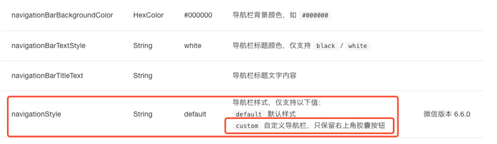

## 微信小程序自定义导航栏（wx_custom_navigation_bar）
### 可选择返回键、首页键，动态设置标题，响应式组件

### 文档

<a target='_blank' href='https://developers.weixin.qq.com/miniprogram/dev/framework/config.html#%E5%85%A8%E5%B1%80%E9%85%8D%E7%BD%AE'  >文档介绍</a>

  </img>

### 效果截图
</img>

